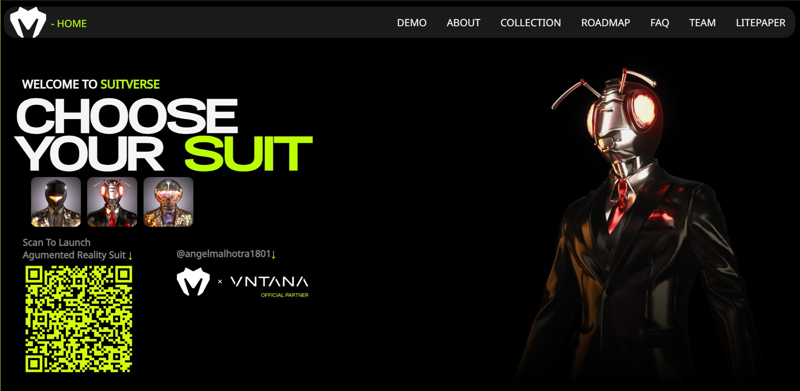

# SuitVerse — Awwwards Remake

A stylish **Awwwards-inspired** fashion landing page built using **React**, **JSX**, **Locomotive Scroll**, and **modern CSS3** techniques.

Live Site: [Check it out here](https://suit-verse.vercel.app)

---

## Tech Stack

- HTML5 / CSS3
- React.js
- JSX
- Locomotive Scroll
- Framer Motion
- Styled Components

---

## Preview



---

## About

This is a remake of an Awwwards-level concept site to showcase smooth scrolling animations, modern typography, and responsive UI tailored for a futuristic fashion brand in Web3.

---

## 👤 Author

**Angel Malhotra**  
[@angelmalhotra1801](https://www.github.com/angelmalhotra1801)

---

## 🚀 Setup & Run Locally

```bash
npm install
npm start
